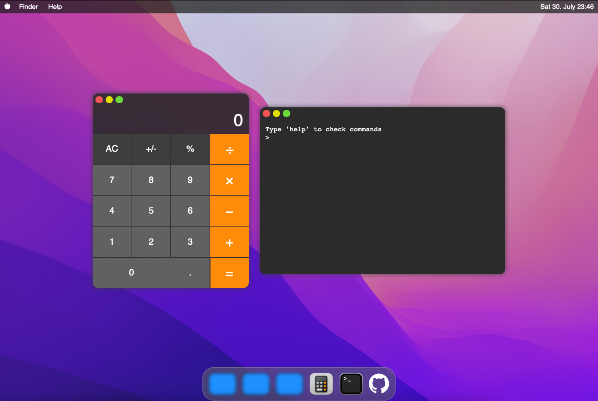
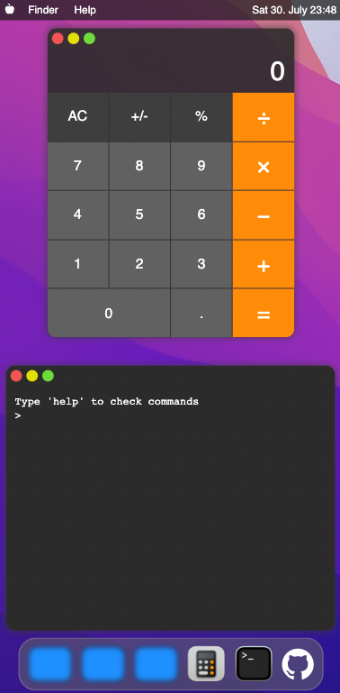

# macos-dummy-environment

[Live Preview](https://takispig.github.io/macos-dummy-environment/)

  
  

 
This project is a website that tries to recreate the GUI of the macosx, with a dummy terminal and a calculator.
It offers only the basic functionalities, so no draggable windows whatsoever (yet).  
There have been used only HTML, CSS and JavaScript.

